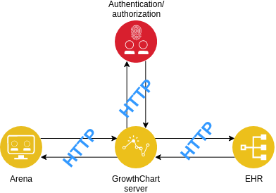

GrowthChart-Server
===

---

# Agenda

- Requirements
- ASP.NET Core
- Server structure
- Testing

---

# Requirements

---

# Requirements

- Data stored as EHR archetypes

---

# Requirements

- Data stored as EHR archetypes
- Translate AQL &rarr; Domain objects

---

# Requirements

- Data stored as EHR archetypes
- AQL queries &rarr; Domain objects
	- E.g. "Give me all height registrations for patient x"

---

# Requirements

- Data stored as EHR archetypes
- AQL queries &rarr; Domain objects
	- E.g. "Give me all height registrations for patient x"
- Microservice architecture

---

# Requirements

- Data stored as EHR archetypes
- AQL queries &rarr; Domain objects
	- E.g. "Give me all height registrations for patient x"
- Microservice architecture

---

# Requirements

- Data stored as EHR archetypes
- AQL queries &rarr; Domain objects
	- E.g. "Give me all height registrations for patient x"
- Microservice architecture

---

# ASP.NET Core

---

# ASP.NET Core
- Complete redesign

---

# ASP.NET Core
- Complete redesign
- Lightweight

---

# ASP.NET Core
- Complete redesign of the ASP stack
- Lightweight
- Platform independent