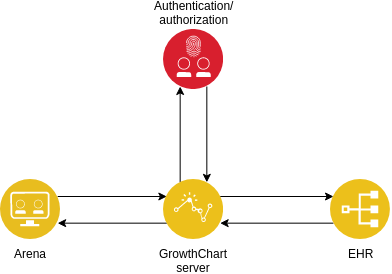

GrowthChart-Server
===

---

# Agenda

- Requirements
- ASP.NET Core
- Server structure
- End-to-end testing

---

# Requirements

- Data stored as EHR archetypes
- AQL queries &rarr; Domain objects
	- E.g. "Give me all height registrations for patient x"
- _**Microservice**_ architecture

---

# ASP.NET Core
- Complete redesign of the ASP stack
- Lightweight
- Platform independent
- Targets .NET 4.x, Standard and Core
+++
## [Kestrel](https://docs.microsoft.com/en-us/aspnet/core/fundamentals/servers/kestrel?tabs=aspnetcore2x)

- ASP.NET Core web server
	- Self-host 
	- or behind _reverse proxy_ (IIS, Nginx, Apache)

- Simple setup
+++

